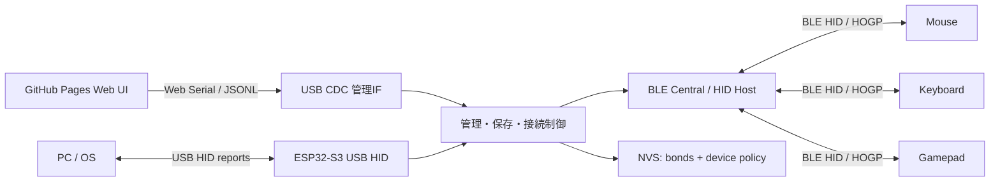

# Architecture

## 目的

ESP32-S3製ドングルにBluetoothペアリング情報と接続ポリシーを保存し、ドングルを別PCへ差し替えても、事前登録したBLE HID機器をそのまま使えるようにします。

PCから見ると、ドングルはUSBキーボード/マウス/ゲームパッド/管理用シリアルを持つUSB複合デバイスです。Bluetooth周辺機器はPCと直接ペアリングせず、ESP32-S3とだけペアリングします。

## MVPの範囲

- BLE HIDマウス
- BLE HIDキーボード
- BLE HIDゲームパッド
- 複数台のペアリング保存
- 起動時の自動再接続
- Web UIからのスキャン、ペアリング、削除、接続、切断
- PC側USBはHID + CDCの複合デバイス

## ESP32-S3単体で難しい/不可な範囲

- Bluetooth Classic専用キーボード/マウス
- DualShock系などClassic HIDが必要なコントローラ
- 一般的なBluetoothイヤホン(A2DP/HFP)
- 低遅延/高品質オーディオドングル

イヤホンやClassic機器も本気で扱うなら、ESP32-S3単体ではなく、次のどちらかが現実的です。

- ESP32-S3をUSB/Web管理担当にし、外部dual-mode BluetoothコントローラをHCIで接続する。
- Linux SBCまたはUSB Bluetoothアダプタを使い、ESP32-S3は管理/補助に回す。

## 保存する情報

Bluetoothの暗号鍵やbond情報はBluetooth stack側のNVS領域に保存します。アプリ側では次のメタデータを別途保存します。

- 内部ID
- Bluetooth address / address type
- 表示名
- HID種別
- 自動接続フラグ
- 最終接続時刻
- report descriptorの要約またはキャッシュ

## 接続の考え方

起動時は保存済みデバイスを読み込み、自動接続フラグが有効なものから再接続します。BLE HID reportを受信したら、report descriptorに基づいてUSB HID reportへ変換し、PCへ送ります。

MVPでは変換対象をBoot Keyboard、Boot Mouse、標準Gamepadに絞ります。その後、任意HID report descriptorのマッピングUIを足すと、多様なデバイスへ広げられます。

## USB構成案

- Interface 0: CDC ACM 管理用
- Interface 1: HID Keyboard
- Interface 2: HID Mouse
- Interface 3: HID Gamepad

ESP32-S3のUSB Device Stackはエンドポイント数に上限があるため、最終的には1つのHID interfaceに複数Report IDを載せる構成も検討します。

## セキュリティ

- Web UIはローカルUSB接続したユーザー操作でのみ接続できます。
- 管理プロトコルには`protocol`と`nonce`を含め、将来の互換性を確保します。
- Bond削除時はアプリ側メタデータとBluetooth stack側bondを両方消します。
- NVS encryption / flash encryptionは量産段階で検討します。ただしESP32-S3のUSB機能との相性確認が必要です。

## 開発ロードマップ

1. Web Serial管理UIとJSONLプロトコルを固定する。
2. ファームが`hello`、`dongle.status`、`bond.list`へ応答する。
3. BLE scan結果をWebへevent送信する。
4. BLE HIDペアリングとbond保存を実装する。
5. USB HID keyboard/mouse report送信を実装する。
6. BLE HID reportからUSB HID reportへの変換を実装する。
7. 複数同時接続、再接続、優先度制御を詰める。
8. Gamepad対応、report descriptorマッピング、設定保存を拡張する。

